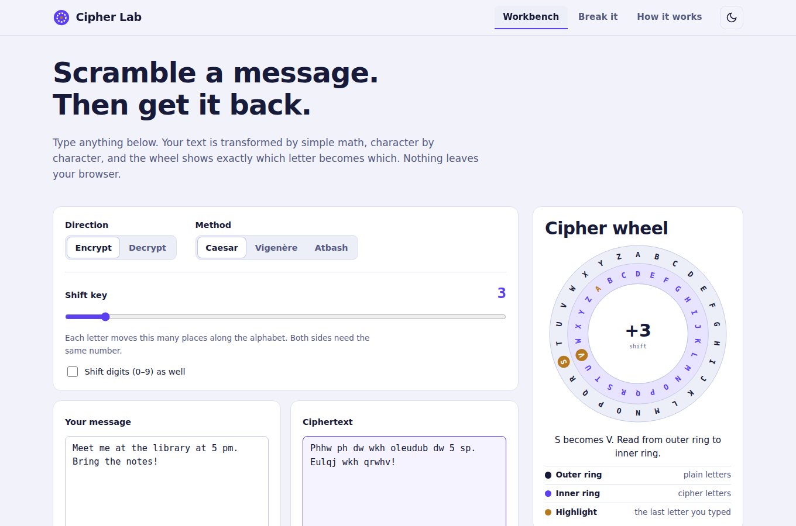

# Cipher Lab

**Project 2 · Basic Encryption & Decryption** · DecodeLabs Cyber Security Internship, Batch 2026

An interactive workbench that encrypts and decrypts text with the **Caesar**, **Vigenère** and **Atbash** ciphers. A live cipher wheel shows exactly which letter becomes which, a step-by-step table shows the math behind every character, and a built-in **attack lab** breaks your own message to show why classical ciphers are not secure.



> **Live demo:** `https://shadow-exe64.github.io/cipher-lab/` (see [Deploy](#deploy-to-github-pages))

---

## Project requirements → where to find them

| Requirement from the brief | Implemented in |
| --- | --- |
| Encrypt user text with a basic logic (Caesar cipher or similar) | Workbench → *Encrypt*, methods Caesar / Vigenère / Atbash |
| Decrypt the encrypted text | Workbench → *Decrypt*, and the **Use as input** button for one-click round trips |
| Display both encrypted and decrypted output | Input and result panels side by side, plus a **Round trip verified** badge |
| Apply the math: `ord()`, `chr()`, `% 26` | `assets/js/cipher.js` and `python/caesar_cli.py`; the *Watch the math* table shows each step |
| Handle edge cases (spaces, punctuation) | Non-letters pass through unchanged; case, Unicode and wrap-around (`Y + 3 → B`) are tested |
| Validate with the decryption function | Every result is decrypted again automatically and compared with the original |
| Optional extras from the conclusion | User-chosen shift key and a Vigenère cipher |

## Features

- **Three ciphers.** Caesar (shift 1–25, optional digit shifting), Vigenère (keyword) and Atbash (mirror alphabet).
- **Cipher wheel.** An SVG wheel that turns with the key and highlights the last letter you typed. In Vigenère mode it rotates per letter.
- **Watch the math.** For each character: ASCII code → subtract base → add key → `mod 26` → add base → result, with wrap-arounds flagged.
- **Attack lab.** Tries all 25 Caesar keys, ranks them by chi-squared distance from English letter frequencies, shows a frequency chart, and reports its confidence. Includes a *guess the shift* challenge game.
- **Learn tab.** Input-process-output model, ASCII pipeline you can play with, the formulas, Python code, why Caesar is weak, and how AES improves on it.
- **Quality of life.** Copy, save `.txt`, open `.txt`, light / dark theme, keyboard-accessible tabs, responsive layout, remembers your settings (never your text).
- **Private.** Everything runs in your browser. No network requests are made with your text.
- **Python companion.** `python/caesar_cli.py` offers encrypt / decrypt / crack from the terminal, plus an interactive menu.

## Run it locally

No build step and no dependencies.

```bash
git clone https://github.com/Shadow-Exe64/cipher-lab.git
cd cipher-lab
npm start          # serves http://localhost:8080  (or: python3 -m http.server 8080)
```

You can also just double-click `index.html`.

### Command line (Python 3.8+)

```bash
python python/caesar_cli.py encrypt "Hello, World!" --key 3      # Khoor, Zruog!
python python/caesar_cli.py decrypt "Khoor, Zruog!" --key 3      # Hello, World!
python python/caesar_cli.py encrypt "Attack at dawn" --keyword LEMON
python python/caesar_cli.py crack "Phhw ph dw wkh oleudub diwhu wkh ohfwxuh"
python python/caesar_cli.py                                      # interactive menu
```

## Tests

```bash
npm test                                   # JavaScript engine (Node 18+)
python3 -m unittest discover -s python -v  # Python CLI
```

The suite covers known test vectors, wrap-around, negative and oversized keys, every key round-tripping, Unicode preservation, invalid input, and the brute-force attack.

## How it works

```
Plaintext ──► Algorithm + Key ──► Ciphertext
             (shift integers)
```

1. Convert each letter to its ASCII code (`A = 65`, `a = 97`).
2. Subtract the base so `A = 0 … Z = 25`.
3. Add the key (subtract it to decrypt).
4. Apply `% 26` so the alphabet wraps around.
5. Add the base back and convert to a character.

```python
cipher_char = chr((ord(char) - 65 + shift) % 26 + 65)
```

**Note on modulo.** JavaScript's `%` keeps the sign of the dividend (`-3 % 26 === -3`). The engine uses a true modulo, `((n % m) + m) % m`, so decryption never produces negative positions.

## Project structure

```
.
├── index.html                # single-page app
├── assets/
│   ├── css/base.css          # shared UI primitives
│   ├── css/styles.css        # theme tokens + layout
│   └── js/
│       ├── cipher.js         # pure cipher engine (browser + Node)
│       └── app.js            # UI: workbench, wheel, attack lab, learn tab
├── python/
│   ├── caesar_cli.py         # command-line version
│   └── test_caesar_cli.py
├── tests/cipher.test.js      # engine tests (node:test)
├── docs/screenshot.png
└── .github/workflows/pages.yml
```

## Deploy to GitHub Pages

1. Push this repository to GitHub (branch `main`).
2. Go to **Settings → Pages** and set **Source** to **GitHub Actions**.
3. The included workflow runs the tests and publishes the site on every push to `main`.

## Security note

Caesar, Vigenère and Atbash are **teaching ciphers**. They can be broken in milliseconds (the attack lab proves it). Never use them to protect real data. For real applications use a vetted library and a modern algorithm such as AES-GCM or ChaCha20-Poly1305.

## Ideas to extend it

- Add a Playfair or rail-fence cipher.
- Add a Kasiski / index-of-coincidence attack on Vigenère.
- Add a "compare with AES" panel using the Web Crypto API.

## License

MIT. See [LICENSE](LICENSE).
